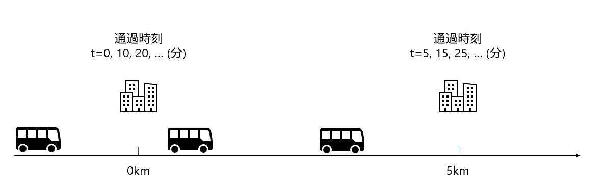

# 微動アレイ観測解析手法 - 技術ノート

## 微動アレイ観測でなにが知りたいのか

- 目的
   - 目的1：波の振動数ごとの速度が知りたい
      - 位相速度が知りたい
   - 目的2：地盤のS波速度分布を知りたい
- これの簡単な説明は[こちら](https://nagaokautacjp-my.sharepoint.com/:p:/g/personal/shiga_vos_nagaokaut_ac_jp/EVt-zQzR5HpNtBw0k32lG8cBKfBp0e9YLDPzMfEBUUqSng?e=ySVhrq)を参照してください。

### 位置 $x$ と時刻 $t$ における波の振幅 $a(x, t)$ の式

$$
a(x, t) = \sum_{i} A_i \sin(k_i x - \omega_i t + \phi_i) \hspace{30pt} (1) 
$$

> [!NOTE]
> こちらの式は、`ipynb`ファイルの `1: 位置 $x$ と時刻 $t$ における波の振幅 $a(x, t)$ の式`セルで、実際に動かして見れます。

- 目的1で知りたいのは位相速度 $c_i$ です。これは波数 $k_i$ と振動数 $\omega_i$ から求められます。
   - $c_i = \omega_i / k_i = f_i \lambda_i$
   - より正確な表現でいうと、ある $\omega_i$ と $k_i$ に対してその波がどれぐらい強く含まれているのか ( $A_i$ ) が知りたいということです。
- ここで、 $a(x, t)$ は位置 $x$ と時刻 $t$ における波の振幅、 $A_i$ は $i$ 番目の波の振幅、 $k_i$ は波数、 $\omega_i$ は角振動数、 $\phi_i$ は位相を表します。
   - 波数と波長の関係
      - $k_i = 2 \pi / \lambda_i$
   - 振動数と周期の関係
      - $\omega_i = 2 \pi f_i = 2 \pi / T_i$
   - 実際に測れるのは、左側の $a(x, t)$ だけであり、右側の各成分（ $A_i$, $k_i$, $\omega_i$, $\phi_i$ ）は直接的には測定できません。
      - もう少し言うと、ある時間間隔、ある特定の位置における $a(x_m, t_n)$ の値しかわからない状態です。(離散化された状態)
- 繰り返しになりますが、求めたいのは $A(\omega_i, k_i, \phi_i)$ の値です。

それではどうしましょうか？

##  $A(\omega_i, k_i, \phi_i)$ の値を求める方法

### 大崎先生の本で習った (習う) フーリエ変換

大崎先生の本 (新・地震動のスペクトル解析入門) で出てきたフーリエ変換は **時間領域の信号を振動数領域に変換** する手法です。

$$
\begin{align*}
A(\omega_i) &= \frac{1}{N} \sum_{n=0}^{N-1} a(t_n) e^{-i \omega_i t_n} \hspace{30pt} (2-1) \\
C_k &= \frac{1}{N} \sum_{m=0}^{N-1} a(t_m) e^{-i 2 \pi k m /N} \hspace{30pt} (2-2) \\
\end{align*}
$$

式(2-2)は、大崎先生の本の式(4.44)に対応するもので、変数の定義が異なるだけです。

この中で式(2-1)の左辺が、ある位置 $x$ における振幅を表すものとして、$A(\omega_i, x)$ と置き換えます。そうすると、式(2-1)は次のようになります。

$$
A(\omega_i, x) = \frac{1}{N} \sum_{n=0}^{N-1} a(x, t_n) e^{-i \omega_i t_n} \hspace{30pt} (2-3)
$$

この $A(\omega_i, x)$ に対してさらに位置 $x$ に関するフーリエ変換を行います。

$$
A(k_i, \omega_i) = \frac{1}{M} \sum_{m=0}^{M-1} A(\omega_i, x_m) e^{-i k_i x_m} \hspace{30pt} (2-4)
$$

このようにして、位置 $x$ と時刻 $t$ に依存する波の振幅を、波数 $k_i$ と振動数 $\omega_i$ に依存する振幅に変換できます。

つまりこの方法では2回フーリエ変換を行うことによって、 $a(x, t)$ を $A(k_i, \omega_i)$ に変換することができます。

この手法で微動の位相速度を求める手法を **F-K変換** と呼びます。

> [!NOTE]
> こちらの式は、`ipynb`ファイルの `2: F-K変換` セルで実際に動かして見れます。

#### 補足

- Q: 位相はどこにいったの？
   - A: 位相は、$A(k_i, \omega_i)$ の複素数の偏角として含まれています。つまり、$A(k_i, \omega_i) = |A(k_i, \omega_i)| e^{i \phi(k_i, \omega_i)}$ の形で表現されます。

## もう一つの方法

上記のF-K変換は、時間領域の信号を振動数-波数領域に変換する手法ですが、デメリットがあります。このデメリットを克服するために、実際にはもう一つの方法があり、これを **空間自己相関法（SPAC法）** と呼びます。

このSPAC法の基本的な考え方を理解するために、簡単な以下の問題を考えてみましょう。

### 問題1

#### 条件
- 定期的にくるバス：10分間隔に1回通過
- 2つのバス停間の距離：5km
- 2つのバス停で同時に時刻を計測
   - バス停1では：0分、10分、20分、30分、40分、50分にバスが通過
   - バス停2では：5分、15分、25分、35分、45分、55分にバスが通過

#### 問題
- この条件でのバスの速度と間隔は？
   - バス停1とバス停2の通過時刻の差を計算
      - 今回は一番短い間隔で5分とする

解答

- バスの速度：5km/5分 = 60km/h
- バスの間隔：60km/h × 10分 = 10km

別解

- バスの速度：5km/5分 = 60km/h
- バスの間隔：60km/h × 10分 = 10km

#### 上の問題を波に置き換えると

- バスの間隔 → 波の波長
- バスの速度 → 波の速度
- バス停を通過する頻度 → 波の振動数 or 周期

### 1次元の波の式で考えてみましょう

$$
u(x, t) = A \sin(kx - \omega t + \phi) 
\hspace{30pt} (2)
$$

ここで出てくる変数は以下のとおりです。
- $u(x, t)$ ：位置 $x$ と時刻 $t$ における波の振幅
- $A$ ：波の振幅
- $k$ ：波数（ $k = 2\pi / \lambda$ ）
   - $\lambda$ ：波長
- $\omega$ ：角振動数（ $\omega = 2\pi f$ 
   - $f$ ：振動数
- $\phi$ ：位相

いま、2つの観測点で波を観測したとします。( $x = 0$ と $x = r$ )

$$
u_1(t) = A \sin(-\omega t + \phi) \\
u_2(t) = A \sin(kr - \omega t + \phi)
$$

理由は後で説明しますが、ひとまずこれの積を計算してみましょう。

$$
\begin{align*}
u_1(t) u_2(t) &= A^2 \sin(-\omega t + \phi) \sin(kr - \omega t + \phi) \\
&= \frac{A^2}{2} \left[ \cos(kr) - \cos(kr - 2\omega t + 2\phi) \right]
\end{align*}
$$

第1式から第2式への変形は、三角関数の積和の公式 $\sin A \sin B = \frac{1}{2} [\cos(A - B) - \cos(A + B)]$ を用いました。

次にこれの時間平均をとります。 時間平均は$\langle \hspace{10pt} \rangle$ で囲って、$\langle u_1(t) u_2(t) \rangle$ と書きます。

$$
\langle u_1(t) u_2(t) \rangle = \frac{A^2}{2} \left[ \cos(kr) - \langle \cos(kr - 2\omega t + 2\phi) \rangle \right]
$$

右辺の第2項は時間平均をとるとゼロになります。なぜなら、$-1 \leqq \cos(kr - 2\omega t + 2\phi) \leqq 1$ となるため、十分に長い時間を取って平均すると0になります。

したがって、時間平均は次のようになります。

$$
\langle u_1(t) u_2(t) \rangle = \frac{A^2}{2} \cos(kr) \hspace{30pt} (3)
$$

同じように $u_1(t)$ 同士での積の時間平均と、 $u_2(t)$ 同士での積の時間平均を計算すると、どちらも $A^2/2$ になる。(式(3)の $kr = 0$ の場合と考えてもらえればよいです)

$$
\langle u_1(t) u_1(t) \rangle = \langle u_2(t) u_2(t) \rangle = \frac{A^2}{2} \hspace{30pt} (4)
$$

なので、式(3)を それぞれの積の平方根で割ると、

$$
\begin{align*}
\frac{\langle u_1(t) u_2(t) \rangle}{\sqrt{\langle u_1(t) u_1(t) \rangle \langle u_2(t) u_2(t) \rangle}} 
= \frac{\frac{A^2}{2} \cos(kr)}{\sqrt{\frac{A^2}{2} \cdot \frac{A^2}{2}}} = \cos(kr) = \cos\left(\frac{2\pi r}{\lambda}\right) \hspace{30pt} (5)
\end{align*}
$$

となります。

この式は、2つの波の正規化された積 (相関) の時間平均は、波数と距離 $r$ の関数であることを示しています。先程のバスの例でいうと、 $kr$ の値がある一定値になったとき、すなわち距離 $r$ が波長 $\lambda$ の整数倍のとき、相関が1となります。

この式の嬉しい点は、微動観測の観点から言うと、左辺は2地点間の観測記録のみから計算できて、その結果から右辺で波長が計算できるということです。

- 例えば $(左辺) = 0$ の場合
   - $\cos(kr) = 0$ となるので、$kr = \pi/2, 3\pi/2, \ldots$ となります。
- また $(左辺) = 1$ の場合
   - $\cos(kr) = 1$ となるので、$kr = 0, 2\pi, 4\pi, \ldots$ となります。
- $(左辺) = -1$ の場合
   - $\cos(kr) = -1$ となるので、$kr = \pi, 3\pi, 5\pi, \ldots$ となります。

ある観測点間の距離$r$がわかっていれば、$(左辺)$の値から波長$\lambda$が計算できます。

そして、わかりにくいかもしれませんが、式5は、ある特定の振動数 $\omega$ に対して計算されています。つまり、ここで計算される $\lambda, k$ は、特定の振動数 $\omega$ に対応する波長、波数です。つまりある振動数 $\omega$ と 波数 $k$ から計算される 位相速度 $c$は、次のように表すことが出来ます。

$$
\begin{align*}
\lambda &= \lambda(\omega), \ k = k(\omega) \\
c &= \frac{\omega}{k} = \frac{\omega}{k(\omega)} \\
\end{align*}
$$

このようにすることで、特定の振動数 $\omega$に対する位相速度$c$を計算できます。こうした空間的な波の相関を利用して、位相速度を推定する手法が **空間自己相関法（SPAC法）** です。

> [!NOTE]
> こちらの式は、`ipynb`ファイルの `3: 空間自己相関法（SPAC法）の基礎 - 2地点間の波の相関` セルと `観測点間距離と相関の関係` で実際に動かして見れます。

#### 補足

- Q: F-K変換で得られるものと、この相関で得られる結果って何か違くない？ (F-k変換では振幅も求まるけど、相関では振幅は求まらないのでは？)
   - A: はい確かに違います。
      - F-K変換は、時間領域の信号を振動数-波数領域に変換する手法であり、特定の振動数成分に対する振幅と位相を求めることができます。
         - 同じ振動数でも複数の波数 (位相速度) の波が存在する場合でも、分けて求めることが出来ます。
      - 一方、空間自己相関法（SPAC法）は、観測点間の相関を利用して、波の位相速度を推定する手法です。
         - SPAC法では、暗黙の了解として、ある振動数 $\omega$ での波数 $k$ (あるいは 位相速度 $c$)は一つだけという仮定があります。
            - 実際の波はそうではないんですが、そのような仮定を置くことで、観測点間の相関から位相速度を推定することが可能になります。
         - 別の言い方をすればF-k変換のうち最も振幅が大きいところを選ぶことで、SPAC法と同じ結果が得られるということです。

## F-k変換

### F-K法の理論的背景

F-K法（Frequency-Wavenumber Method）は、時空間領域の波動場データを振動数-波数領域に変換することで、波の伝播特性を解析する手法です。

#### なぜF-K変換から位相速度が推定可能なのか？

##### 直感的な理解

波動場を観測すると、時間と空間の両方で周期的な変化が見られます：
1. **時間的な周期性**：ある場所で観測すると、一定の周期で振動（振動数f）
2. **空間的な周期性**：ある時刻で見ると、一定の間隔で波の山と谷（波長λ、波数k）
3. **両者の関係**：波の速度c = f × λ = ω/k

F-K変換は、この時空間の周期性を同時に解析し、どの振動数とどの波数の組み合わせが卓越しているかを明らかにします。

##### 数学的な導出：時空間領域から振動数-波数領域への変換

**ステップ1：1次元波動の復習**

まず、x方向に伝播する単一の平面波を考えます：
$$u(x,t) = A \exp[i(kx - \omega t)] \hspace{30pt} (F-1)$$

ここで：
- $k = 2\pi/\lambda$：波数
- $\omega = 2\pi f$：角振動数
- 位相速度：$c = \omega/k = f\lambda$

**ステップ2：2次元アレイでの観測**

実際の微動観測では、複数の観測点（アレイ）でデータを取得します。観測点の位置を$\mathbf{r}_j = (x_j, y_j)$とすると、観測される波動場は様々な方向から到来する平面波の重ね合わせになります：

$$u(\mathbf{r}_j, t) = \int\int A(\mathbf{k}) \exp[i(\mathbf{k} \cdot \mathbf{r}_j - \omega t)] d^2\mathbf{k} \hspace{30pt} (F-2)$$

ここで：
- $\mathbf{k} = (k_x, k_y)$：波数ベクトル
- $A(\mathbf{k})$：波数$\mathbf{k}$を持つ波の振幅密度

**ステップ3：2次元フーリエ変換**

離散的な観測データ$u(x_m, y_n, t_l)$に対して、3次元フーリエ変換を適用します：

$$U(k_x, k_y, \omega) = \sum_m \sum_n \sum_l u(x_m, y_n, t_l) \exp[-i(k_x x_m + k_y y_n - \omega t_l)] \Delta x \Delta y \Delta t \hspace{30pt} (F-3)$$

実際の計算では、まず時間方向のフーリエ変換を行い、特定の振動数成分を抽出します：

$$U(x_m, y_n, \omega) = \sum_l u(x_m, y_n, t_l) \exp[i\omega t_l] \Delta t \hspace{30pt} (F-4)$$

次に、この振動数成分に対して空間方向の2次元フーリエ変換を行います：

$$U(k_x, k_y, \omega) = \sum_m \sum_n U(x_m, y_n, \omega) \exp[-i(k_x x_m + k_y y_n)] \Delta x \Delta y \hspace{30pt} (F-5)$$

**ステップ4：パワースペクトル密度**

F-K スペクトル（パワースペクトル密度）は次のように計算されます：

$$P(k_x, k_y, \omega) = |U(k_x, k_y, \omega)|^2 \hspace{30pt} (F-6)$$

これは、振動数$\omega$において、波数$(k_x, k_y)$を持つ波のエネルギーを表します。

**ステップ5：位相速度の推定**

波数ベクトルの大きさと方向は次のように求められます：
$$|\mathbf{k}| = \sqrt{k_x^2 + k_y^2} \hspace{30pt} (F-7)$$
$$\theta = \arctan(k_y/k_x) \hspace{30pt} (F-8)$$

位相速度は以下の式で計算できます：
$$c = \frac{\omega}{|\mathbf{k}|} = \frac{2\pi f}{\sqrt{k_x^2 + k_y^2}} \hspace{30pt} (F-9)$$

F-Kスペクトルのピークを探すことで、卓越する波の波数と伝播方向が決定されます。

##### 物理的イメージ：平面波の重ね合わせとしての理解

**単一平面波の場合**

ある方向$\theta$から速度$c$で到来する平面波を考えます：
$$u(\mathbf{r}, t) = A \exp[i(k_x x + k_y y - \omega t)] \hspace{30pt} (F-10)$$

ここで：
- $k_x = k\cos\theta = (\omega/c)\cos\theta$
- $k_y = k\sin\theta = (\omega/c)\sin\theta$

この波をF-K変換すると、 $(k_x, k_y)$ の位置に鋭いピークが現れます。

**複数の平面波の場合**

実際の波動場は、様々な方向から到来する波の重ね合わせです：
$$u(\mathbf{r}, t) = \sum_i A_i \exp[i(k_{xi} x + k_{yi} y - \omega t)] \hspace{30pt} (F-11)$$

F-K変換により、各波に対応する $(k_{xi}, k_{yi})$ の位置にピークが現れ、それぞれの波の特性が明らかになります：
- 伝播方向：$\theta_i = \arctan(k_{yi}/k_{xi})$
- 位相速度：$c_i = \omega/\sqrt{k_{xi}^2 + k_{yi}^2}$

これらが同時に決定されます。

##### 離散フーリエ変換の実装における注意点

**1. 空間サンプリング定理**

観測点間隔$\Delta x$に対して、解析可能な最大波数（ナイキスト波数）は次のようになります：
$$k_{max} = \frac{\pi}{\Delta x} \hspace{30pt} (F-12)$$

これに対応する最小波長は：
$$\lambda_{min} = \frac{2\pi}{k_{max}} = 2\Delta x \hspace{30pt} (F-13)$$

つまり、観測点間隔の2倍より短い波長は正しく解析できません（空間エイリアシング）。

**2. 波数分解能**

アレイの大きさ（アパーチャ）$L$により、波数分解能が決まります：
$$\Delta k = \frac{2\pi}{L} \hspace{30pt} (F-14)$$

大きなアレイほど、波数（したがって伝播方向と速度）を精密に決定できます。

**3. ゼロパディング**

実際の計算では、空間データにゼロパディングを施すことで以下の効果が得られます：
- FFTの計算効率向上
- 波数空間での補間効果
- スペクトルの見かけの分解能向上（ただし、実質的な分解能は変わらない）

### 基本原理の詳細説明

#### 2次元フーリエ変換の展開

**連続系での定義**

時空間領域から振動数-波数領域への変換は次のように表されます：
$$U(\mathbf{k}, \omega) = \int_{-\infty}^{\infty} \int_{-\infty}^{\infty} \int_{-\infty}^{\infty} u(\mathbf{r}, t) \exp[-i(\mathbf{k} \cdot \mathbf{r} - \omega t)] d^2\mathbf{r} dt \hspace{30pt} (F-15)$$

逆変換は次のようになります：
$$u(\mathbf{r}, t) = \frac{1}{(2\pi)^3} \int_{-\infty}^{\infty} \int_{-\infty}^{\infty} \int_{-\infty}^{\infty} U(\mathbf{k}, \omega) \exp[i(\mathbf{k} \cdot \mathbf{r} - \omega t)] d^2\mathbf{k} d\omega \hspace{30pt} (F-16)$$

**離散系での実装**

N個の観測点$\mathbf{r}_j = (x_j, y_j)$、$j = 1, 2, ..., N$での観測データに対して以下の手順で処理を行います：

1. 時間窓の設定とフーリエ変換
   $$U(\mathbf{r}_j, \omega) = \sum_{n=0}^{N_t-1} u(\mathbf{r}_j, t_n) w(t_n) \exp[i\omega t_n] \Delta t \hspace{30pt} (F-17)$$
   
   ここで$w(t_n)$は窓関数（例：Hanning窓）

2. 空間配列の正規化
   アレイの重心を原点として座標を正規化

3. 2次元空間フーリエ変換
   $$U(k_x, k_y, \omega) = \sum_{j=1}^{N} U(\mathbf{r}_j, \omega) \exp[-i(k_x x_j + k_y y_j)] \hspace{30pt} (F-18)$$

#### アレイ応答関数の導出

アレイ応答関数（Array Response Function, ARF）は、特定の波数に対するアレイの感度を表します：

$$ARF(\mathbf{k}) = \left| \sum_{j=1}^{N} \exp[i\mathbf{k} \cdot \mathbf{r}_j] \right|^2 \hspace{30pt} (F-19)$$

##### なぜこの式がアレイの感度を表すのか

**1. ビームフォーミングの観点から**

平面波の到来を考えます。波数ベクトル $\mathbf{k}_0$ を持つ平面波が全観測点に到来する場合：
$$u_j(t) = A \exp[i(\mathbf{k}_0 \cdot \mathbf{r}_j - \omega t)]$$

特定の波数 $\mathbf{k}$ に対してアレイが「探査」する際、各観測点の信号に位相補正を加えて合成します：
$$\text{アレイ出力} = \sum_{j=1}^{N} u_j(t) \exp[-i\mathbf{k} \cdot \mathbf{r}_j]$$

波数が一致する場合（$\mathbf{k} = \mathbf{k}_0$）：
$$\text{アレイ出力} = \sum_{j=1}^{N} A \exp[i(\mathbf{k}_0 \cdot \mathbf{r}_j - \omega t)] \exp[-i\mathbf{k}_0 \cdot \mathbf{r}_j] = N \cdot A \exp[-i\omega t]$$

全ての観測点からの寄与が同位相で加算され、振幅が $N$ 倍になります。

波数が一致しない場合（$\mathbf{k} \neq \mathbf{k}_0$）：
各観測点からの寄与に位相差 $(\mathbf{k}_0 - \mathbf{k}) \cdot \mathbf{r}_j$ が生じ、部分的にキャンセルされます。

**2. 感度の定量化**

ARFは、この「波数の一致度に応じた応答の強さ」を定量化します：
$$ARF(\mathbf{k}) = \left| \sum_{j=1}^{N} \exp[i\mathbf{k} \cdot \mathbf{r}_j] \right|^2$$

これは、波数 $\mathbf{k}$ の平面波に対するアレイの応答強度を表します。

**3. 物理的解釈：干渉パターン**

建設的干渉の条件：
- 全ての観測点で位相項 $\exp[i\mathbf{k} \cdot \mathbf{r}_j]$ が同じ値を持つとき
- すべての項が同じ方向を向く
- $|ARF| = N^2$（最大感度）

破壊的干渉の条件：
- 位相項がランダムに分布するとき
- ベクトルの和が小さくなる
- $|ARF| \ll N^2$（低感度）

**4. 具体例：直線アレイ**

観測点が等間隔 $d$ で配置された直線アレイ（$x_j = jd$, $j = 0, 1, ..., N-1$）の場合：
$$ARF(k_x) = \left| \sum_{j=0}^{N-1} \exp[ik_x jd] \right|^2$$

等比級数の公式を使うと：
$$ARF(k_x) = \left| \frac{1 - \exp[iNk_xd]}{1 - \exp[ik_xd]} \right|^2 = \frac{\sin^2(Nk_xd/2)}{\sin^2(k_xd/2)}$$

この関数の特徴：
- $k_x = 0, \pm\frac{2\pi}{d}, \pm\frac{4\pi}{d}, ...$ で最大値 $N^2$
- メインローブの幅：$\Delta k_x \approx \frac{2\pi}{Nd}$
- 周期的なピーク（グレーティングローブ）

**5. なぜこれが「感度」なのか**

信号検出の観点：
1. **目標波数での応答**：ARFが大きい → その波数の波を効率的に検出
2. **ノイズ抑制**：ARFが小さい → その波数のノイズを抑制
3. **選択性**：鋭いピーク → 特定の波数のみを選択的に検出

エネルギー集約の観点：
$$\text{出力パワー} \propto |ARF(\mathbf{k})|$$

ARFが大きいほど、その波数成分のエネルギーを効率的に集約できます。

**6. アレイ設計への応用**

ARFの性質から、以下のアレイ設計指針が得られます：
1. **高感度**：メインローブでのARF値を最大化
2. **高分解能**：メインローブ幅を狭く
3. **低サイドローブ**：不要な波数での感度を抑制
4. **広帯域特性**：様々な波数で良好な性能

**まとめ**

アレイ応答関数ARFは、「特定の波数を持つ平面波に対して、アレイ全体がどれだけ協調的に（コヒーレントに）応答するか」を表す指標です。これは：
- **物理的には**：各観測点からの寄与の干渉パターン
- **数学的には**：位相項の和の二乗ノルム
- **工学的には**：空間フィルタの周波数応答

として理解でき、アレイの波数選択性と感度を定量的に評価する基本的なツールとなっています。

**理想的なアレイ応答**
- メインローブ：真の波数で最大値
- サイドローブ：できるだけ小さく
- 波数分解能：メインローブの幅で決定

**アレイ配置の影響**

1. **正三角形アレイ**
   - 等方的な応答
   - 6回対称性

2. **十字型アレイ**
   - 直交する2方向で高分解能
   - 45°方向で分解能低下

3. **円形アレイ**
   - 方位に依存しない均一な応答
   - SPAC法との相性が良い

4. **不規則アレイ**
   - サイドローブの抑制に有効
   - 最適化手法により配置決定

#### ビームフォーミングの原理

ビームフォーミングは、特定の方向・速度から到来する波を強調する空間フィルタリング技術です：

**遅延和ビームフォーミング**

スローネスベクトル$\mathbf{s} = (s_x, s_y) = \mathbf{k}/\omega$に対して次のように計算します：

$$B(\mathbf{s}, \omega) = \sum_{j=1}^{N} U(\mathbf{r}_j, \omega) \exp[i\omega \mathbf{s} \cdot \mathbf{r}_j] \hspace{30pt} (F-20)$$

ビームパワーは次のように定義されます：
$$P(\mathbf{s}, \omega) = |B(\mathbf{s}, \omega)|^2 \hspace{30pt} (F-21)$$

**最尤法（Maximum Likelihood Method）**

より高度な手法として、ノイズの統計的性質を考慮することができます：

1. クロススペクトル行列の計算
   $$C_{jk}(\omega) = \langle U(\mathbf{r}_j, \omega) U^*(\mathbf{r}_k, \omega) \rangle \hspace{30pt} (F-22)$$

2. 最尤推定量
   $$P_{ML}(\mathbf{s}, \omega) = \frac{1}{\mathbf{e}^H(\mathbf{s}) \mathbf{C}^{-1}(\omega) \mathbf{e}(\mathbf{s})} \hspace{30pt} (F-23)$$
   
   ここで$\mathbf{e}(\mathbf{s}) = [e^{i\omega \mathbf{s} \cdot \mathbf{r}_1}, ..., e^{i\omega \mathbf{s} \cdot \mathbf{r}_N}]^T$

#### スローネスベクトルと波数ベクトルの関係

**スローネス（Slowness）の定義**

スローネスは位相速度の逆数として定義されます：
$$s = \frac{1}{c} \hspace{30pt} (F-24)$$

スローネスベクトルは次のように表されます：
$$\mathbf{s} = \frac{\mathbf{k}}{\omega} = \frac{1}{c}\hat{\mathbf{n}} \hspace{30pt} (F-25)$$

ここで$\hat{\mathbf{n}}$は伝播方向の単位ベクトルです。

**なぜスローネスを使うのか**

1. **振動数によらない表現**
   - 同じ速度の波は、振動数によらず同じスローネスを持つ
   - 分散曲線の表示に便利

2. **時間遅延との直接的な関係**
   - 観測点間の到達時間差：$\Delta t = \mathbf{s} \cdot \Delta \mathbf{r}$
   - ビームフォーミングでの遅延補正が直感的

3. **解析範囲の設定**
   - 最大スローネス = 1/（最小速度）
   - 通常、表面波解析では$s_{max} = 1/(100 \text{ m/s})$程度

**F-K解析の実際の手順**

1. **データの前処理**
   - 機器特性の補正
   - トレンド除去
   - バンドパスフィルタ

2. **時間窓の設定**
   - 窓長：解析する最低振動数の数周期分
   - オーバーラップ：通常50%

3. **振動数ごとのF-K解析**
   - 各振動数でF-Kスペクトル計算
   - ピーク検出により卓越波数決定

4. **分散曲線の作成**
   - 各振動数での位相速度
   - 品質管理（SNR、ピークの明瞭度）

5. **結果の解釈**
   - 基本モード/高次モードの識別
   - SPAC法の結果との比較・統合

## SPAC法（空間自己相関法）

### 理論的背景
SPAC法（Spatial Autocorrelation Method）は、Aki (1957) により提案された手法で、微動の空間的な相関を利用して位相速度を推定する。

#### なぜ空間相関から位相速度が推定できるのか

##### 直感的な理解
2つの観測点で同じ波を観測する場合を考える：
1. **観測点間距離が波長の整数倍**：波形が完全に一致（相関係数 = 1）
2. **観測点間距離が波長の半整数倍**：波形が逆位相（相関係数 = -1）
3. **その他の距離**：中間的な相関値

この相関の周期性から波長を推定でき、振動数との関係から位相速度が求まる。

##### 数学的な導出：2点間相関からベッセル関数へ

座標原点に観測点1（位置ベクトル$\mathbf{r}_1 = \mathbf{0}$）、そこから距離$r$離れた位置に観測点2（位置ベクトル$\mathbf{r}_2$）を配置する。SPAC法では各振動数成分を独立に解析するため、特定の角振動数$\omega$（振動数$f = \omega/2\pi$）の成分に着目する。

振動数領域での波動場は、全方位から到来する平面波の重ね合わせとして表現される：

$$u(\mathbf{r}, \omega) = \int_0^{2\pi} A(\theta, \omega) \exp[i\mathbf{k}(\theta) \cdot \mathbf{r}] d\theta \hspace{30pt} (2-1)$$

ここで：
- $\mathbf{k}(\theta) = k[\cos\theta, \sin\theta]^T$：方位角$\theta$方向の波数ベクトル
- $k = |\mathbf{k}| = \omega/c = 2\pi f/c$：波数の大きさ
- $A(\theta, \omega)$：方位角$\theta$方向からの振動数$\omega$の波の複素振幅
- $c$：位相速度

観測点1（原点）での波動場：
$$u(\mathbf{r}_1, \omega) = u(\mathbf{0}, \omega) = \int_0^{2\pi} A(\theta, \omega) d\theta \hspace{30pt} (2-2)$$

観測点2（位置$\mathbf{r}_2$）での波動場：
$$u(\mathbf{r}_2, \omega) = \int_0^{2\pi} A(\theta, \omega) \exp[i\mathbf{k}(\theta) \cdot \mathbf{r}_2] d\theta \hspace{30pt} (2-3)$$

観測点2が観測点1から距離$r$、方位角$\alpha$の位置にある場合、$\mathbf{r}_2 = r[\cos\alpha, \sin\alpha]^T$より：
$$\mathbf{k}(\theta) \cdot \mathbf{r}_2 = kr\cos(\theta - \alpha) \hspace{30pt} (2-4)$$

**ステップ1：相関関数の計算**

振動数領域での2点間のクロススペクトル密度は：
$$S_{12}(\omega) = \langle u(\mathbf{r}_1, \omega) u^*(\mathbf{r}_2, \omega) \rangle \hspace{30pt} (2-5)$$

ここで、$\langle \cdot \rangle$はアンサンブル平均を表す。式(2-2)と(2-3)を代入：
$$S_{12}(\omega) = \left\langle \int_0^{2\pi} A(\theta_1, \omega) d\theta_1 \cdot \left[\int_0^{2\pi} A^*(\theta_2, \omega) \exp[-i\mathbf{k}(\theta_2) \cdot \mathbf{r}_2] d\theta_2\right] \right\rangle \hspace{30pt} (2-6)$$

式(2-4)を用いて：
$$S_{12}(\omega) = \left\langle \int_0^{2\pi} \int_0^{2\pi} A(\theta_1, \omega) A^*(\theta_2, \omega) \exp[-ikr\cos(\theta_2 - \alpha)] d\theta_1 d\theta_2 \right\rangle \hspace{30pt} (2-7)$$

**ステップ2：等方的波動場の仮定**

微動が定常確率過程であり、異なる方向からの波は統計的に独立（非相関）であると仮定する。すなわち：
$$\langle A(\theta_1, \omega) A^*(\theta_2, \omega) \rangle = S_A(\theta, \omega) \delta(\theta_1 - \theta_2) \hspace{30pt} (2-8)$$

ここで、$S_A(\theta, \omega)$は方位角$\theta$方向からの波のパワースペクトル密度。

等方的な波動場の仮定では、全方位から等しい強度の波が到来するため：
$$S_A(\theta, \omega) = S_0(\omega) = \text{const} \hspace{30pt} (2-9)$$

式(2-7)に式(2-8)を適用すると：
$$S_{12}(\omega) = \int_0^{2\pi} \int_0^{2\pi} S_0(\omega) \delta(\theta_1 - \theta_2) \exp[-ikr\cos(\theta_2 - \alpha)] d\theta_1 d\theta_2 \hspace{30pt} (2-10)$$

デルタ関数の性質を用いて$\theta_1$についての積分を実行する。デルタ関数の定義より：
$$\int_0^{2\pi} f(\theta_1) \delta(\theta_1 - \theta_2) d\theta_1 = \begin{cases}
f(\theta_2) & \text{if } 0 \leq \theta_2 \leq 2\pi \\
0 & \text{otherwise}
\end{cases} \hspace{30pt} (2-10a)$$

ここで$f(\theta_1) = 1$なので：
$$S_{12}(\omega) = S_0(\omega) \int_0^{2\pi} \left[\int_0^{2\pi} \delta(\theta_1 - \theta_2) d\theta_1\right] \exp[-ikr\cos(\theta_2 - \alpha)] d\theta_2 \hspace{30pt} (2-10b)$$

内側の積分は$\theta_2 \in [0, 2\pi]$のとき1となるため：
$$S_{12}(\omega) = S_0(\omega) \int_0^{2\pi} \exp[-ikr\cos(\theta_2 - \alpha)] d\theta_2 \hspace{30pt} (2-11)$$

変数を$\theta = \theta_2$と書き直すと：
$$S_{12}(\omega) = S_0(\omega) \int_0^{2\pi} \exp[-ikr\cos(\theta - \alpha)] d\theta \hspace{30pt} (2-11)$$

**ステップ3：パワースペクトル密度の計算**

観測点1でのパワースペクトル密度：
$$S_{11}(\omega) = \langle |u(\mathbf{r}_1, \omega)|^2 \rangle = \langle u(\mathbf{r}_1, \omega) u^*(\mathbf{r}_1, \omega) \rangle \hspace{30pt} (2-12a)$$

式(2-2)より$u(\mathbf{r}_1, \omega) = u(\mathbf{0}, \omega) = \int_0^{2\pi} A(\theta, \omega) d\theta$なので：
$$S_{11}(\omega) = \left\langle \left[\int_0^{2\pi} A(\theta_1, \omega) d\theta_1\right] \left[\int_0^{2\pi} A^*(\theta_2, \omega) d\theta_2\right] \right\rangle \hspace{30pt} (2-12b)$$

式(2-8)の関係を用いると：
$$S_{11}(\omega) = \int_0^{2\pi} \int_0^{2\pi} \langle A(\theta_1, \omega) A^*(\theta_2, \omega) \rangle d\theta_1 d\theta_2$$
$$= \int_0^{2\pi} \int_0^{2\pi} S_0(\omega) \delta(\theta_1 - \theta_2) d\theta_1 d\theta_2 \hspace{30pt} (2-12c)$$

デルタ関数により$\theta_1$についての積分を実行：
$$S_{11}(\omega) = S_0(\omega) \int_0^{2\pi} d\theta_2 = 2\pi S_0(\omega) \hspace{30pt} (2-12)$$

観測点2でのパワースペクトル密度も同様に計算される。式(2-3)より：
$$S_{22}(\omega) = \left\langle \left|\int_0^{2\pi} A(\theta, \omega) \exp[i\mathbf{k}(\theta) \cdot \mathbf{r}_2] d\theta\right|^2 \right\rangle \hspace{30pt} (2-13a)$$

$$= \int_0^{2\pi} \int_0^{2\pi} S_0(\omega) \delta(\theta_1 - \theta_2) \exp[i\mathbf{k}(\theta_1) \cdot \mathbf{r}_2] \exp[-i\mathbf{k}(\theta_2) \cdot \mathbf{r}_2] d\theta_1 d\theta_2 \hspace{30pt} (2-13b)$$

デルタ関数により$\theta_1 = \theta_2$となり、指数関数の積は1になる：
$$S_{22}(\omega) = S_0(\omega) \int_0^{2\pi} d\theta = 2\pi S_0(\omega) \hspace{30pt} (2-13)$$

したがって、等方的波動場では全ての観測点で同じパワースペクトル密度を持つ。

**ステップ4：正規化された空間自己相関係数**

空間自己相関係数は以下のように定義される：
$$\rho(r, \omega) = \frac{S_{12}(\omega)}{\sqrt{S_{11}(\omega) S_{22}(\omega)}} = \frac{S_0(\omega) \int_0^{2\pi} \exp[-ikr\cos(\theta - \alpha)] d\theta}{2\pi S_0(\omega)} \hspace{30pt} (2-14)$$

観測点2の方位$\alpha$によらないことを示すため、変数変換$\psi = \theta - \alpha$：
$$\rho(r, \omega) = \frac{1}{2\pi} \int_0^{2\pi} \exp[-ikr\cos\psi] d\psi \hspace{30pt} (2-15)$$

**ステップ5：ベッセル関数の認識（Hansenの積分表示）**

第1種$n$次ベッセル関数のHansenの積分表示（一般形）は以下のように与えられる：

$$J_n(z) = \frac{1}{2\pi i^n} \int_0^{2\pi} e^{iz\cos\theta} e^{in\theta} d\theta \hspace{30pt} (2-15a)$$

特に$n = 0$の場合：

$$J_0(z) = \frac{1}{2\pi} \int_0^{2\pi} e^{iz\cos\theta} d\theta \hspace{30pt} (2-16)$$

式(2-15)の積分は、まさにこの$n = 0$の場合と一致する。

式(2-15)において$z = -kr$とおくと：
$$\rho(r, \omega) = \frac{1}{2\pi} \int_0^{2\pi} \exp[-ikr\cos\psi] d\psi = \frac{1}{2\pi} \int_0^{2\pi} e^{i(-kr)\cos\psi} d\psi = J_0(-kr) \hspace{30pt} (2-17)$$

第1種0次ベッセル関数は偶関数であるため：
$$J_0(-z) = J_0(z) \hspace{30pt} (2-18)$$

したがって、空間自己相関係数は：
$$\rho(r, \omega) = J_0(kr) = J_0\left(\frac{2\pi rf}{c(f)}\right) \hspace{30pt} (2-19)$$

ここで、$k = \omega/c = 2\pi f/c$の関係を用いた。この結果は、等方的な波動場における空間相関が、観測点間距離と波長の比によって決定されることを示している。

#### 物理的イメージ：1次元波動による理解

##### 単純な正弦波の場合
まず、最も単純な1次元の正弦波を考える：
$$u(x,t) = A\sin(kx - \omega t) = A\sin\left(\frac{2\pi}{\lambda}x - 2\pi ft\right)$$

2つの観測点（$x_1 = 0$と$x_2 = r$）での波形は：
- 観測点1：$u_1(t) = A\sin(-\omega t)$
- 観測点2：$u_2(t) = A\sin(kr - \omega t)$

位相差は$\Delta\phi = kr = 2\pi r/\lambda$となる。

##### 空間自己相関係数の物理的意味
空間自己相関係数の定義式は：
$$\rho_{12} = \frac{\langle u_1(t) u_2(t) \rangle}{\sqrt{\langle u_1^2(t) \rangle \langle u_2^2(t) \rangle}}$$

ここで$\langle \cdot \rangle$は時間平均を表す。

単純な正弦波の場合、$u_1(t) = A\sin(-\omega t)$、$u_2(t) = A\sin(kr - \omega t)$を代入すると：

**分子の計算**：
$$\langle u_1(t) u_2(t) \rangle = \langle A\sin(-\omega t) \cdot A\sin(kr - \omega t) \rangle$$

三角関数の積の公式：$\sin\alpha \sin\beta = \frac{1}{2}[\cos(\alpha-\beta) - \cos(\alpha+\beta)]$を用いて：
$$= \frac{A^2}{2} \langle \cos(kr) - \cos(kr - 2\omega t) \rangle$$

時間平均により、時間に依存する項$\cos(kr - 2\omega t)$はゼロになり：
$$= \frac{A^2}{2} \cos(kr)$$

**分母の計算**：
$$\langle u_1^2(t) \rangle = \langle A^2\sin^2(-\omega t) \rangle = \frac{A^2}{2}$$
$$\langle u_2^2(t) \rangle = \langle A^2\sin^2(kr - \omega t) \rangle = \frac{A^2}{2}$$

**結果**：
$$\rho_{12} = \frac{\frac{A^2}{2} \cos(kr)}{\sqrt{\frac{A^2}{2} \cdot \frac{A^2}{2}}} = \cos(kr) = \cos\left(\frac{2\pi r}{\lambda}\right)$$

これより、相関係数は観測点間の位相差の余弦となる：

- **$r = 0$（同じ場所）**：$\rho = \cos(0) = 1$（完全に一致）
- **$r = \lambda/4$**：$\rho = \cos(\pi/2) = 0$（位相が90°ずれ、相関なし）
- **$r = \lambda/2$**：$\rho = \cos(\pi) = -1$（逆位相）
- **$r = \lambda$**：$\rho = \cos(2\pi) = 1$（再び一致）

##### 等方的波動場での振る舞い
実際の微動では、波があらゆる方向から到来する。各方向からの波の寄与を足し合わせると：

$$\rho(r) = \frac{1}{2\pi}\int_0^{2\pi} \cos(kr\cos\theta) d\theta = J_0(kr)$$

これがベッセル関数になる理由：
- 観測点を結ぶ方向に進む波：位相差最大（$kr$）
- 垂直方向に進む波：位相差ゼロ
- 全方向の平均がベッセル関数を生む

##### ベッセル関数の特徴的な振る舞い
$$J_0(x) \text{の性質：}$$
- $x = 0$で$J_0(0) = 1$（同一点では完全相関）
- $x \approx 2.405$で初めてゼロ（第1ゼロ点）
- その後も振動しながら減衰

観測点間距離$r$と波長$\lambda$の関係：
- **第1ゼロ点**：$kr = 2\pi r/\lambda \approx 2.405$
- つまり：$r \approx 0.38\lambda$で相関がゼロ

##### 理想的な条件と実用的な意味
理想的な等方的波動場では：
- 全方向から等しい強度の波が到来
- 空間相関はきれいなベッセル関数に従う
- ゼロ点の位置から波長（したがって位相速度）を推定可能

位相速度の推定：
$$c = f\lambda = f \cdot \frac{2\pi r}{2.405} \approx 2.6 \cdot rf \hspace{30pt} (2-19a)$$

これが微動アレイ探査の基本原理：観測点間の相関からレイリー波の波長を求め、地下構造を推定する。

## 付録A: 探査深度の理論的背景

### なぜ探査深度が λ/2 ～ λ/3 なのか

表面波（特にレイリー波）の探査深度が波長の1/2から1/3程度になる理由は、波動の振幅が深さとともに指数関数的に減衰することに起因します。

### レイリー波の変位の深さ分布

レイリー波の変位は、深さ$z$に対して以下のように表現されます：

水平成分：
$$u_x(z) = A \left[ e^{-k\alpha z} - \frac{2\alpha\beta}{1+\beta^2} e^{-k\beta z} \right]$$

鉛直成分：
$$u_z(z) = A \frac{i\alpha}{k} \left[ e^{-k\alpha z} - \frac{2}{1+\beta^2} e^{-k\beta z} \right]$$

ここで：
- $k = 2\pi/\lambda$：波数
- $\alpha = \sqrt{1 - (c/v_p)^2}$
- $\beta = \sqrt{1 - (c/v_s)^2}$
- $c$：レイリー波の位相速度
- $v_p, v_s$：P波、S波速度

### 感度カーネル（Sensitivity Kernel）

レイリー波の位相速度は、各深さの弾性定数の重み付き平均として表現できます。この重み関数（感度カーネル）$K(z)$は：

$$\frac{\partial c}{\partial v_s(z)} = K(z) \propto \left| \frac{\partial u}{\partial z} \right|^2$$

感度カーネルは通常、深さ$z = \lambda/3$付近で最大値を取ります。これは：

1. **浅部（$z < \lambda/4$）**：変位は大きいですが、ひずみ（変位の空間微分）は小さいです
2. **深部（$z > \lambda/2$）**：振幅が急速に減衰し、寄与が小さいです
3. **中間深度（$z \approx \lambda/3$）**：変位とひずみのバランスが最適です

### 実用的な意味

探査深度の目安として$\lambda/2 \sim \lambda/3$を用いる理由：

1. **エネルギー分布**：レイリー波のエネルギーの約70%がこの深度範囲に集中します
2. **感度の観点**：この深度の速度構造変化が位相速度に最も影響します
3. **経験則**：多数の実測例から導かれた実用的な関係です

### 振動数と探査深度の関係

具体的な例（$v_s = 200$ m/sの場合）：

| 振動数 (Hz) | 波長 (m) | 探査深度 (m) |
|------------|----------|--------------|
| 1          | 200      | 65-100       |
| 5          | 40       | 13-20        |
| 10         | 20       | 6.5-10       |
| 20         | 10       | 3.3-5        |

この関係により、異なる振動数の分散曲線から、異なる深さの地下構造情報を得ることができます。

## 付録B: 実体波と表面波の理論式展開

### 波動方程式の基礎

弾性体中の運動方程式（Navier方程式）：
$$\rho \frac{\partial^2 \mathbf{u}}{\partial t^2} = (\lambda + \mu) \nabla(\nabla \cdot \mathbf{u}) + \mu \nabla^2 \mathbf{u} + \mathbf{f} \hspace{30pt} (B-1)$$

ここで：
- $\mathbf{u}$：変位ベクトル
- $\rho$：密度
- $\lambda, \mu$：ラメ定数
- $\mathbf{f}$：外力

変位をポテンシャルで表現します（Helmholtzの分解）：
$$\mathbf{u} = \nabla\phi + \nabla \times \boldsymbol{\psi} \hspace{30pt} (B-2)$$

ここで$\phi$はスカラーポテンシャル、$\boldsymbol{\psi}$はベクトルポテンシャルです。

### 実体波（Body Waves）

#### P波（縦波）
スカラーポテンシャル$\phi$に対する波動方程式：
$$\frac{\partial^2 \phi}{\partial t^2} = v_p^2 \nabla^2 \phi \hspace{30pt} (B-3)$$

P波速度：
$$v_p = \sqrt{\frac{\lambda + 2\mu}{\rho}} = \sqrt{\frac{E(1-\nu)}{\rho(1+\nu)(1-2\nu)}} \hspace{30pt} (B-4)$$

平面波解：
$$\phi = A \exp[i(\mathbf{k}_p \cdot \mathbf{r} - \omega t)] \hspace{30pt} (B-5)$$

変位：
$$\mathbf{u}_p = \nabla\phi = i\mathbf{k}_p A \exp[i(\mathbf{k}_p \cdot \mathbf{r} - \omega t)] \hspace{30pt} (B-6)$$

粒子運動は波の進行方向に平行（縦波）です。

#### S波（横波）
ベクトルポテンシャル$\boldsymbol{\psi}$に対する波動方程式：
$$\frac{\partial^2 \boldsymbol{\psi}}{\partial t^2} = v_s^2 \nabla^2 \boldsymbol{\psi} \hspace{30pt} (B-7)$$

S波速度：
$$v_s = \sqrt{\frac{\mu}{\rho}} = \sqrt{\frac{E}{2\rho(1+\nu)}} \hspace{30pt} (B-8)$$

平面波解（SH波の例）：
$$\psi_z = B \exp[i(k_x x + k_y y - \omega t)] \hspace{30pt} (B-9)$$

変位：
$$\mathbf{u}_s = \nabla \times \boldsymbol{\psi} = \begin{pmatrix} -ik_y B \\ ik_x B \\ 0 \end{pmatrix} \exp[i(k_x x + k_y y - \omega t)] \hspace{30pt} (B-10)$$

粒子運動は波の進行方向に垂直（横波）です。

### 表面波（Surface Waves）

#### レイリー波（Rayleigh Wave）

半無限弾性体（$z \geq 0$）での解を求めます。変位ポテンシャルを以下のように仮定します：
$$\phi = A e^{-q_1 z} e^{i(kx - \omega t)} \hspace{30pt} (B-11)$$
$$\psi_y = B e^{-q_2 z} e^{i(kx - \omega t)} \hspace{30pt} (B-12)$$

ここで、減衰係数は：
$$q_1 = k\sqrt{1 - \frac{c^2}{v_p^2}}, \quad q_2 = k\sqrt{1 - \frac{c^2}{v_s^2}} \hspace{30pt} (B-13)$$

変位成分：
$$u_x = \frac{\partial \phi}{\partial x} - \frac{\partial \psi_y}{\partial z} = ik A e^{-q_1 z} + q_2 B e^{-q_2 z} \hspace{30pt} (B-14)$$
$$u_z = \frac{\partial \phi}{\partial z} + \frac{\partial \psi_y}{\partial x} = -q_1 A e^{-q_1 z} + ik B e^{-q_2 z} \hspace{30pt} (B-15)$$

自由表面での境界条件（$z = 0$で応力ゼロ）：
$$\sigma_{zz} = \lambda \left(\frac{\partial u_x}{\partial x} + \frac{\partial u_z}{\partial z}\right) + 2\mu \frac{\partial u_z}{\partial z} = 0 \hspace{30pt} (B-16)$$
$$\sigma_{xz} = \mu \left(\frac{\partial u_x}{\partial z} + \frac{\partial u_z}{\partial x}\right) = 0 \hspace{30pt} (B-17)$$

これらの条件から、レイリー方程式が導かれます：
$$\left(\frac{c}{v_s}\right)^6 - 8\left(\frac{c}{v_s}\right)^4 + 8\left(3 - 2\frac{v_s^2}{v_p^2}\right)\left(\frac{c}{v_s}\right)^2 - 16\left(1 - \frac{v_s^2}{v_p^2}\right) = 0 \hspace{30pt} (B-18)$$

ポアソン比$\nu = 0.25$の場合、$c_R \approx 0.9194 v_s$となります。

#### レイリー波の粒子運動

振幅比：
$$\frac{B}{A} = -\frac{2ikq_1}{k^2 + q_2^2} \hspace{30pt} (B-19)$$

表面での変位（$z = 0$）：
$$\frac{u_x}{u_z}\bigg|_{z=0} = \frac{ik + q_2 B/A}{-q_1 + ik B/A} \hspace{30pt} (B-20)$$

これにより、粒子は楕円運動を行い、深さとともに振幅が指数関数的に減衰します。

#### ラブ波（Love Wave）

層構造が必要です。上層（厚さ$H$、S波速度$v_{s1}$）と半無限下層（S波速度$v_{s2}$、$v_{s2} > v_{s1}$）を考えます。

SH波の変位（$y$方向のみ）：
- 上層：$u_y^{(1)} = [A\cos(p_1 z) + B\sin(p_1 z)]e^{i(kx - \omega t)}$ \hspace{30pt} (B-21)
- 下層：$u_y^{(2)} = C e^{-q z} e^{i(kx - \omega t)}$ \hspace{30pt} (B-22)

ここで：
$$p_1 = \frac{\omega}{v_{s1}}\sqrt{1 - \frac{c^2}{v_{s1}^2}}, \quad q = k\sqrt{\frac{c^2}{v_{s2}^2} - 1} \hspace{30pt} (B-23)$$

境界条件から分散関係式：
$$\tan(p_1 H) = \frac{\mu_2 q}{\mu_1 p_1} \hspace{30pt} (B-24)$$

### 分散性の物理的意味

表面波の分散性は、波長によって「感じる」深さが異なることに起因する：

1. **短波長（高周波）**：浅部の構造に敏感
2. **長波長（低周波）**：深部まで到達

位相速度$c(\omega)$と群速度$U(\omega)$の関係：
$$U = \frac{d\omega}{dk} = c - \lambda \frac{dc}{d\lambda} \hspace{30pt} (B-25)$$

正常分散（$dc/d\omega > 0$）の場合、$U < c$となり、波束は個々の波より遅く伝播する。

### 地震波の種類（実体波と表面波）

地震波は大きく実体波（body waves）と表面波（surface waves）に分類される。

#### 実体波
実体波は地盤内部を伝播する波動で、以下の2種類がある：

1. **P波（Primary wave、縦波）**
   - 粒子の振動方向と波の進行方向が平行
   - 速度：$v_p = \sqrt{\frac{\lambda + 2\mu}{\rho}}$
   - ここで、$\lambda$, $\mu$：ラメ定数、$\rho$：密度

2. **S波（Secondary wave or Shear Wave、横波）**
   - 粒子の振動方向と波の進行方向が垂直
   - 速度：$v_s = \sqrt{\frac{\mu}{\rho}}$
   - 液体中では伝播しない（$\mu = 0$）

#### 表面波
表面波は地表面に沿って伝播する波動で、振幅が深さとともに指数関数的に減衰する：

1. **レイリー波（Rayleigh wave）**
   - 鉛直面内での楕円運動
   - 微動の主成分（約70%）
   - 速度：約$0.92v_s$（ポアソン比0.25の場合）

2. **ラブ波（Love wave）**
   - 水平面内での振動
   - 速度構造に不連続がある場合に発生
   - SH波の重ね合わせとして表現

### 位相速度と群速度

#### 位相速度（Phase velocity）
位相速度$c$は、単一振動数の波の位相が伝播する速度：

$$c = \frac{\omega}{k} = f\lambda$$

ここで：
- $\omega = 2\pi f$：角振動数
- $k = 2\pi/\lambda$：波数
- $f$：振動数
- $\lambda$：波長

#### 群速度（Group velocity）
群速度$U$は、波束（エネルギー）が伝播する速度：

$$U = \frac{d\omega}{dk} = c - \lambda\frac{dc}{d\lambda}$$

#### 2つの正弦波の重ね合わせによる理解

位相速度と群速度の違いを理解するため、わずかに異なる振動数を持つ2つの正弦波の重ね合わせを考える：

$$u(x,t) = \sin(k_1x - \omega_1t) + \sin(k_2x - \omega_2t)$$

ここで、$k_1 = k - \Delta k$、$k_2 = k + \Delta k$、$\omega_1 = \omega - \Delta\omega$、$\omega_2 = \omega + \Delta\omega$とすると、

三角関数の和積公式を用いて：

$$u(x,t) = 2\cos(\Delta k \cdot x - \Delta\omega \cdot t) \sin(kx - \omega t)$$

この式は以下のように解釈できる：

1. **搬送波（carrier wave）**：$\sin(kx - \omega t)$
   - 位相速度で伝播：$c = \frac{\omega}{k}$
   - 個々の波の山や谷の移動速度

2. **包絡線（envelope）**：$2\cos(\Delta k \cdot x - \Delta\omega \cdot t)$
   - 群速度で伝播：$U = \frac{\Delta\omega}{\Delta k} \rightarrow \frac{d\omega}{dk}$（$\Delta k \rightarrow 0$の極限）
   - 波束（wave packet）全体の移動速度
   - エネルギーの伝播速度

#### 物理的意味

- **位相速度**：単一振動数成分の位相が進む速度。実際には観測できない概念的な速度
- **群速度**：波のエネルギーや情報が伝わる速度。実際に観測される波束の移動速度

分散性媒質では$c \neq U$となり：
- 正常分散（$\frac{dc}{d\omega} > 0$）：$U < c$
- 異常分散（$\frac{dc}{d\omega} < 0$）：$U > c$

#### 分散性
媒質が不均質な場合、位相速度は振動数に依存し（分散性）、これにより地下構造の推定が可能となる。正常分散の場合：
- 高振動数（短波長）→ 浅部の情報
- 低振動数（長波長）→ 深部の情報

### 表面波の分散性
微動の主成分は表面波（レイリー波）であり、その位相速度は振動数（または波長）に依存する。この分散性により、地下構造を推定することが可能となる。

位相速度 $c(f)$ と波長 $\lambda$ の関係：

$$c(f) = f \times \lambda$$

探査深度の目安：

$$\text{探査深度} \approx \frac{\lambda}{2} \sim \frac{\lambda}{3}$$